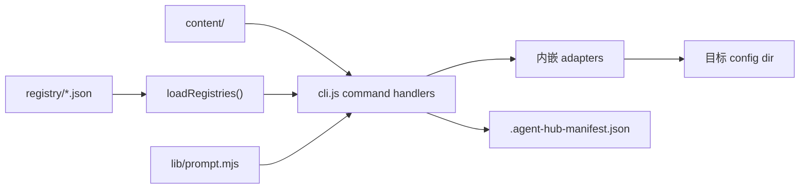

# ARCHITECTURE.md

## 这个系统是什么？

Agent Hub 是一个零依赖的 Node.js ESM CLI（`cli.js`），用于集中维护 AI agent 配置资源，并把这些资源复制安装到本机 Kiro、Codex、Claude Code 等目标配置目录。资源包括 skills、prompts、hooks、agents；仓库中的 `content/` 是唯一内容源，`registry/` 是安装元数据。

系统的核心目标是可审计、默认可预览、复制式同步。安装流程通过内嵌 target adapter 解析目标目录，通过 registry 选择资源，通过 copy + managed manifest 记录已安装资源。CLI 不依赖服务端、数据库或常驻进程。

项目本身也是 Harness Engineering skill 的内容源，`content/skills/harness-docs/` 会像普通资源一样被安装到目标 agent。

## 代码分层模型

**智能体必须遵守的规则：**
- `content/` 只存放可安装资源；不要把安装逻辑放进内容目录
- `registry/` 只描述资源元数据；不要在 registry 中编码目标路径规则
- `cli.js` 是当前唯一 CLI 入口；新增行为先在此保持清晰内聚，只有复杂度真实上升时再拆分模块
- `lib/prompt.mjs` 只负责零依赖终端交互，不承载安装业务规则
- 目标差异（默认 config dir、env var、资源类型目录）通过 adapters 对象封装

## 技术栈

| 层级 | 技术 | 备注 |
|------|------|------|
| CLI runtime | Node.js 22+ / ESM | 零依赖，单文件 `cli.js` |
| 交互式选择 | `lib/prompt.mjs` | 零依赖终端交互库 |
| 内容格式 | Markdown, JSON, shell, PowerShell | 按资源目录复制安装 |
| 配置目录 | `KIRO_HOME`, `CODEX_HOME`, `CLAUDE_HOME` | 不允许硬编码个人绝对路径 |
| 持久状态 | `.agent-hub-manifest.json` | 写入目标 config dir，记录已安装资源 |
| 格式检查 | `scripts/format.mjs` | 统一换行、去 BOM、清理行尾空白 |
| 数据库 / 缓存 / 服务端 | 无 | 本项目是纯本地 CLI |

## 依赖选择原则

- 零依赖：只使用 Node.js 标准库（fs、path、os、readline）
- 不引入需要后台服务、全局安装或用户机器特定状态的依赖
- 跨平台路径差异通过 adapters 封装，不在命令流程中散落条件分支
- 写入行为使用显式 `--apply`；不加 `--apply` 的安装命令只预览计划
- 当前没有 TypeScript 构建产物；不要在文档、CI 或脚本中引用 `src/` 或 `dist/cli.js` 作为现行实现

## 关键架构决策

1. **复制而非 symlink**：目标 agent 运行时不依赖当前仓库存在
2. **默认 dry-run**：安全第一，`--apply` 才写入；`agent-hub install` 无参数进入交互式实际安装流程
3. **受管状态写在目标侧**：`.agent-hub-manifest.json` 在目标 config dir，不依赖 git 或源仓库状态
4. **默认只安装 `default: true` 资源**：`--resource`/`--all` 负责显式选择
5. **单文件 CLI**：零构建步骤，clone 后 `node cli.js` 即可使用
6. **交互式安装**：无参数运行 `install` 进入多步骤选择界面

详见 `docs/design-docs/core-beliefs.md`。
