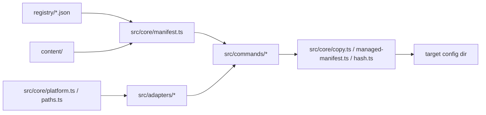
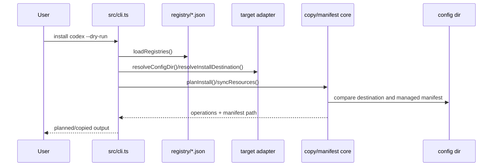

# ARCHITECTURE.md

## 这个系统是什么？

Agent Hub 是一个 TypeScript CLI 和内容仓库，用于集中维护 AI agent 配置资源，并把这些资源复制安装到本机 Codex、Kiro、Claude Code 等目标配置目录。资源包括 skills、prompts、hooks、agents；仓库中的 `content/` 是唯一内容源，`registry/` 是安装元数据。

系统的核心目标是可审计、可回滚、不会误删用户本地配置。安装流程通过目标 adapter 解析目标目录，通过 registry 选择资源，通过 copy/hash/managed manifest 记录 agent-hub 管理的文件。CLI 不依赖服务端、数据库或常驻进程。

项目本身也是 Harness Engineering skill 的内容源，`content/skills/harness-engineering/` 会像普通资源一样被安装到目标 agent。修改该 skill 时要同时考虑 skill 运行时体验、模板质量、脚本可移植性和 agent-hub 的复制安装语义。

## 业务领域

业务领域划分维护在 `docs/DOMAINS.md`。本文件只记录长期技术架构与依赖方向。

## 代码分层模型

**智能体必须遵守的规则：**

- `content/` 只存放可安装资源；不要把安装逻辑放进内容目录。
- `registry/` 只描述资源元数据；不要在 registry 中编码目标路径规则。
- `src/core/` 可以被 commands 和 adapters 调用，但不能依赖 CLI 输出格式。
- `src/adapters/` 只负责目标差异：默认 config dir、env var、资源类型目录和安装目标路径。
- `src/commands/` 可以做输出编排和参数映射，不承载 copy、hash、manifest 等共享规则。
- `install/` 只做 bootstrap；新增业务逻辑应进入 TypeScript 并由 tests 覆盖。

## 技术栈

| 层级 | 技术 | 备注 |
|------|------|------|
| CLI runtime | Node.js 22+ / TypeScript ESM | `package.json` 声明 `type: module` 和 `engines.node >=22` |
| 构建 | `tsc -p tsconfig.json` | 输出到 `dist/`，CLI bin 为 `dist/cli.js` |
| 测试 | Vitest | `npm test` 运行 `tests/` |
| 内容格式 | Markdown, JSON, shell, PowerShell, TypeScript helper scripts | 内容按资源目录复制安装 |
| 配置目录 | `CODEX_HOME`, `KIRO_HOME`, `CLAUDE_HOME`, `--config-dir` | 不允许硬编码个人绝对路径 |
| 持久状态 | `.agent-hub-manifest.json` | 写入目标 config dir，只记录 agent-hub 管理的资源 |
| 数据库 / 缓存 / 服务端 | 无 | 本项目是本地 CLI |
| CI/CD | 未在仓库中声明 | 本地验证命令是当前事实来源 |

## 安装流程

## 依赖选择原则

- 优先使用 Node.js 标准库；本项目的核心路径、文件、hash、copy 逻辑应保持透明。
- 新增 runtime 依赖前必须证明它降低了维护成本，并更新 registry/installation 相关测试。
- 不引入需要后台服务、全局安装或用户机器特定状态的依赖。
- 跨平台行为要通过 `src/core/platform.ts` 或 adapter 封装，不在命令中散落条件分支。
- 对 destructive 行为使用显式命令和 dry-run；默认路径必须可预览。

## 关键架构决策

- 资源安装采用复制而不是 symlink，避免目标 agent 运行时依赖当前仓库存在。
- 目标冲突默认阻止安装；只有 `--force` 才允许替换未受管目标。
- 受管状态写在目标 config dir 的 `.agent-hub-manifest.json`，不要依赖 git 或源仓库状态推断已安装资源。
- 默认安装只处理 `default: true` 的资源；`--resource`、`--type`、`--all` 负责显式选择。
- 长期工程原则见 `docs/design-docs/core-beliefs.md`。
