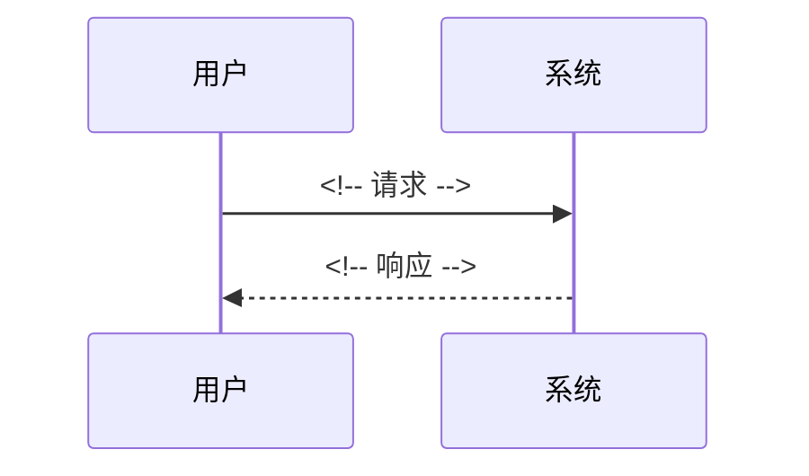

<!--
  frontmatter 字段说明：
  - id:       唯一标识，格式 design-{slug}
  - status:   draft | verified | stale（lint 强制校验）
  - owner:    负责人
  - tags:     领域标签
  - created/verified: ISO 日期（verified = 最后一次确认设计与实现一致）
  同目录下的 spec.md 和 plan.md 共享相同 slug，无需显式交叉引用。

  本文档承接 product-spec，回答"怎么做"。
  智能体基于此文档生成 exec-plan 和实现代码时，应能提取：
    - 技术方案的核心数据流和接口契约
    - 不可违反的技术约束
    - 需要修改的模块和影响范围
    - 迁移/兼容/回滚策略
    - 验证方案正确性的具体方式
-->

# 设计文档：{标题}

## 背景

<!-- 从 product-spec 中提取：解决什么问题、为什么现在做。 -->
<!-- 不要复制 product-spec，用一段话概括动机，链接到原文。 -->

## 技术方案

### 数据模型

<!-- 新增/修改的实体、字段、关系。用表格或代码块表达。 -->

### 接口契约

<!-- 从 product-spec 的"输入与输出"映射为技术接口。API 端点 / 函数签名 / 消息格式。 -->

### 核心流程

<!-- 用 Mermaid 画出主流程。对应 product-spec 中的用户场景。 -->

## 影响范围

| 模块/文件 | 变更类型 | 说明 |
|-----------|----------|------|
| <!-- 路径 --> | 新增 / 修改 / 删除 | <!-- 改什么 --> |

## 约束（智能体必须遵守）

- <!-- 产品约束：继承自 product-spec -->
- <!-- 技术约束：如"必须向后兼容现有 API" -->
- <!-- 性能约束：如"p99 < 200ms" -->

## 迁移与兼容

<!--
  涉及 schema 变更、API 变更、数据格式变更时必填。不涉及则写"不适用"。
-->

- **Schema migration**：<!-- 迁移脚本路径 / DDL / 不适用 -->
- **数据回填（backfill）**：<!-- 是否需要、策略、预估耗时 / 不适用 -->
- **向后兼容**：<!-- 旧客户端/旧数据如何处理 -->
- **Feature flag**：<!-- flag 名称和启用条件 / 不使用 -->

## 发布与回滚

- **发布策略**：<!-- 全量 / 灰度 / 分批 -->
- **回滚方案**：<!-- 如何回滚、回滚后数据如何处理 -->
- **回滚触发条件**：<!-- 什么指标异常时触发回滚 -->

## 观测性

- **关键指标**：<!-- 需要新增或关注的 metrics -->
- **告警规则**：<!-- 阈值和通知渠道 -->
- **日志/追踪**：<!-- 需要新增的结构化日志或 span -->

## 异常处理

| 场景 | 技术处理方式 |
|------|-------------|
| <!-- 场景 --> | <!-- 重试 / 降级 / 报错 / 熔断 --> |

## 验证方式

- 单元测试：<!-- 覆盖哪些核心逻辑 -->
- 集成测试：<!-- 覆盖哪些端到端流程 -->
- 性能测试：<!-- 如果有性能约束 -->

## 备选方案

| 方案 | 优势 | 否决原因 |
|------|------|----------|
| <!-- 方案 A --> | <!-- 优势 --> | <!-- 原因 --> |

## 参考资料

<!-- 相关文档、RFC 或外部资源 -->
