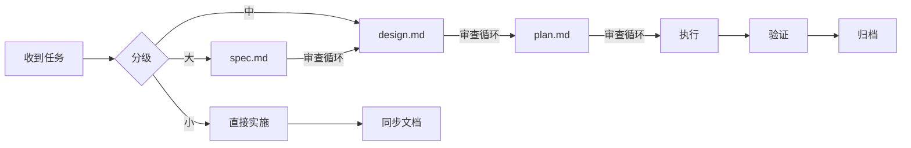

# 需求工作流

<!--
  方法论文件。定义"从收到任务到落地变更"的标准流转路径。
  智能体在开始任何需求工作前必须读此文件。
  按任务量级走不同工作流，减少返工与漂移。
-->

## 入口

1. 先读 `AGENTS.md`，确定任务类型
2. 若涉及架构/依赖方向调整，先读 `ARCHITECTURE.md`
3. 按下方任务分级表判断走哪条工作流

## 任务分级

| 级别 | 判定条件 | 工作流 | 产出物 |
|------|----------|--------|--------|
| 小任务 | ≤ 3 个 task，单模块，无契约变更 | 方案确认 → 直接实施 | 无正式文档 |
| 中任务 | 4-8 个 task，或跨 2 模块，或涉及契约/状态机变更 | design.md → plan.md → 实施 | 需求目录（无 spec） |
| 大任务 | > 8 个 task，跨 3+ 模块，新领域接入，依赖方向变更 | spec.md → design.md → plan.md → 实施 | 完整需求目录 |

**中/大任务判定条件（满足任一即升级）：**
- 跨 2 个以上模块
- 涉及依赖方向变更或新增模块间依赖
- 涉及对外契约变更（API 路径、错误码、消息 schema、Webhook 协议）
- 涉及状态机变更（审批流、发布流、批次状态流转）
- 涉及新领域接入
- 中/大任务中独立 task ≥ 5 个时，使用 subagent 并行实施（详见 `docs/guides/PLANS.md`）

## 审查循环（所有中/大任务文档必须经过）

每份需求文档生成后，执行 `docs/guides/REVIEW.md` 定义的三轮自审循环：

```
生成草稿 → R1 结构审查 → 改进 → R2 逻辑审查 → 改进 → R3 可执行审查 → 终稿
```

- 每轮 4 个维度，每维度 1-5 分，通过线 16/20
- 每轮最多 2 次修改尝试，超过则输出当前最佳版本 + 未解决问题列表
- 三轮全部通过后在文档末尾附加 `<!-- review-trace -->` 审查轨迹
- **未通过审查的文档不得进入下游流程**

详细评分维度和审查规则见 `docs/guides/REVIEW.md`。

---

## 小任务工作流

```
收到任务 → 评估影响范围 → 直接实施 → 同步文档 → 登记遗留
```

1. **评估影响范围**：确认 ≤ 3 个 task、单模块、无契约变更
2. **直接实施**，保持分层
3. **同步文档**：更新受影响的已有文档（ARCHITECTURE 等）
4. **登记遗留**：有遗留问题记到 `docs/active/tech-debt-tracker.md`

不需要创建需求目录，不需要审查循环。

---

## 中任务工作流

```
收到任务 → 创建需求目录 → 写 design.md → 审查循环
         → 写 plan.md → 审查循环 → 执行 → 归档
```

跳过 spec.md（需求已经足够明确，不需要产品规格层面的定义）。

### Step 1: 创建需求目录

1. 创建目录 `docs/active/{需求名}/`
2. 复制 `docs/active/_template/design.md` 和 `_template/plan.md` 到该目录
3. 将 frontmatter 中的 `{slug}` 替换为需求名，`YYYY-MM-DD` 替换为当天日期
4. 在 `docs/active/index.md` 索引表中添加条目

不要复制 `spec.md`。中任务默认没有产品规格层。

### Step 2: 写 design.md + 审查循环

输入：任务描述 + 对话中的方案共识
方法论：`docs/guides/DESIGN.md`

生成草稿后，**停下。读 `docs/guides/REVIEW.md` 并执行三轮审查。未通过审查的文档不得进入下一步。**
- R1 重点：三个子节（数据模型/接口契约/核心流程）是否都有实质内容
- R2 重点：约束是否可验证，影响范围是否完整
- R3 重点：影响范围表是否可直接拆任务

审查通过后 frontmatter status 设为 `draft`。

### Step 3: 写 plan.md + 审查循环

输入：通过审查的 design.md
方法论：`docs/guides/PLANS.md`

生成草稿后，**停下。读 `docs/guides/REVIEW.md` 并执行三轮审查。未通过审查的文档不得进入下一步。**
- R1 重点：每个任务的 6 个字段（id/depends_on/scope/verify/agent/status）是否完整
- R2 重点：design→plan 映射是否完整
- R3 重点：verify 命令是否可执行，模拟执行第一个任务是否无阻塞

审查通过后 frontmatter status 设为 `not-started`。

### Step 4: 执行 → 归档

按 `docs/guides/PLANS.md` 执行规则。完成后 plan status → `completed`，design status → `verified`。

---

## 大任务工作流

```
收到任务 → 创建需求目录 → 写 spec.md → 审查循环
         → 写 design.md → 审查循环
         → 写 plan.md → 审查循环 → 执行 → 归档
```

### Step 1: 创建需求目录

1. 将 `docs/active/_template/` 整个目录复制为 `docs/active/{需求名}/`
2. 将所有文件 frontmatter 中的 `{slug}` 替换为需求名，`YYYY-MM-DD` 替换为当天日期
3. 在 `docs/active/index.md` 索引表中添加条目

### Step 2: 写 spec.md + 审查循环

输入：用户/人类提出的需求描述
方法论：`docs/guides/SPEC.md`

生成草稿后，**停下。读 `docs/guides/REVIEW.md` 并执行三轮审查。未通过审查的文档不得进入下一步。**
- R1 重点：Out of Scope 是否明确
- R2 重点：验收标准是否可测试，异常场景是否覆盖正常流每步的失败
- R3 重点：是否足够让 design 作者开始工作

审查通过后 frontmatter status 设为 `draft`。

### Step 3: 写 design.md + 审查循环

输入：通过审查的 spec.md
方法论：`docs/guides/DESIGN.md`

**从 spec 到 design 的映射：**

| spec 中的 | → design 中的 |
|-----------|--------------|
| 用户场景 | 核心流程（Mermaid） |
| 输入与输出 | 接口契约 |
| 异常与边界 | 异常处理策略 |
| 产品约束 | 约束（继承 + 叠加技术约束） |
| 验收标准 | 验证方式 |

生成草稿后，**停下。读 `docs/guides/REVIEW.md` 并执行三轮审查。** R2 重点检查上方映射表的完整性。

审查通过后 frontmatter status 设为 `draft`。大任务 design 门禁额外要求：发布与回滚策略已定义、至少一个备选方案。

### Step 4: 写 plan.md + 审查循环

输入：通过审查的 design.md
方法论：`docs/guides/PLANS.md`

**从 design 到 plan 的映射：**

| design 中的 | → plan 中的 |
|-------------|------------|
| 影响范围表每一行 | 一个任务 |
| 模块间依赖关系 | depends_on |
| 验证方式 | verify 命令 |
| 迁移与兼容 | 前置任务 |

生成草稿后，**停下。读 `docs/guides/REVIEW.md` 并执行三轮审查。** R2 重点检查上方映射表的完整性。

审查通过后 frontmatter status 设为 `not-started`。

### Step 5: 执行 → 归档

完成后：plan → `completed`，design → `verified`，spec → `shipped`。

---

## 版本归档工作流

当人类提供版本号时，执行以下流程将已完成的需求归档。

### Step 1: 准备

1. 确认要归档的需求：`docs/active/` 下 plan status = `completed` 的需求
2. 确认所有归档需求的 design status = `verified`
3. 如有未 verified 的 design，先完成验证再归档

### Step 2: 创建版本目录

1. 创建 `docs/archive/{版本号}/`
2. 复制 `docs/archive/_release-template.md` 为 `docs/archive/{版本号}/release.md`

### Step 3: 填写 release.md

1. frontmatter：填写 version、date、retain_until（归档日期 + 12 个月）、previous_version
2. 版本摘要：一段话概括核心变更
3. 包含需求表：从每个需求的 spec/design 提取 slug、概述、变更类型、影响模块
4. 变更范围总览：汇总接口变更、数据变更、依赖变更
5. 发布与回滚：从每个需求的 design.md 汇总
6. 关键决策：从每个需求的 plan.md 决策日志提取
7. 已知遗留：从每个需求的 plan.md 提取未解决项

### Step 4: 移动需求目录

1. 将归档需求目录从 `docs/active/` 复制到 `docs/archive/{版本号}/`
2. 从 `docs/active/` 删除已归档的需求目录

### Step 5: 更新索引

1. 更新 `docs/active/index.md`：删除已归档条目
2. 更新 `docs/archive/index.md`：添加新版本条目
3. 如有前序版本，更新其 release.md 的 `next_version` 字段

### Step 6: 收尾

1. 剩余债务记录到 `docs/active/tech-debt-tracker.md`
2. 验证文档结构完整性

---

## 回退规则

任何阶段发现上游问题，必须回退修复，不允许在当前阶段打补丁：

```
plan 审查发现 design 有问题 → 回到 design，修复后重新审查
design 审查发现 spec 有问题 → 回到 spec，修复后重新审查
spec 需要澄清 → 暂停，请求人类输入
```

回退时：更新上游文档 → 更新 frontmatter 日期 → 检查下游是否需要同步 → 重新执行审查循环。

## 文档与代码冲突

- 以代码现状为主（能运行的、当前逻辑的真实行为）
- 必须显式指出冲突，在 docs/ 补齐新事实或修正文档
- 冲突记录到 `docs/active/tech-debt-tracker.md`

## 全景


