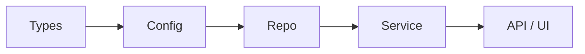

# ARCHITECTURE.md

<!--
  分层定位（重要）：
  本文件记录系统的**长期稳定架构约束**——系统边界、分层、核心依赖方向。
  这些约束不因某个功能迭代而改变；修改本文件应走独立的架构 RFC。

  本文件让智能体在不读代码的情况下理解系统的整体结构。
  包含：系统做什么、业务领域划分、代码分层、技术栈、依赖规则。
  智能体在开始任何编码任务前应先阅读此文件。

  相关的长期约束文档：
  - 工程信条：`docs/design-docs/core-beliefs.md`
  - 可靠性 / 安全：`docs/RELIABILITY.md` / `docs/SECURITY.md`
  - 前端架构（若适用）：写在本文件的相关章节中
  方法论文档（如何写需求/设计/计划）：`docs/guides/`

  本模板语言无关，适用于前端/后端（Java/Python/Go/Node）/
  Android/iOS/CLI/SDK 等任意项目。示例仅作参考，请按项目替换。
-->

## 这个系统是什么？

<!-- 2-3 段：系统做什么、服务谁、关键技术选型、部署模型 -->
<!-- 写给一个从未见过这个项目的智能体——它需要在 30 秒内理解全貌 -->

[项目名称] 是……

## 业务领域

业务领域划分随业务演进变化，独立维护在 `docs/DOMAINS.md`。

## 代码分层模型

<!--
  定义项目的分层模型。以下为**通用参考**，请根据实际技术栈替换：
    - 通用示例：Types → Config → Repo → Service → API/UI
    - Java/Spring：Model → Repository → Service → Controller
    - Python：schema → repository → service → api
    - Go：domain → repository → usecase → handler
    - Android：data → domain → ui（Clean Architecture）
    - 前端：types → api → store → components → pages
  核心约束：依赖方向单向流动，智能体写代码时必须遵守。
-->

<!--
  推荐使用 Mermaid 表达分层与依赖方向（diff 友好、GitHub/GitLab 原生渲染）。
  ASCII 图仅作补充注释，不作为唯一表达。
  参见 `docs/guides/PLANS.md` → "流程图表达约定"。
-->

**智能体必须遵守的规则：**
- 依赖只能从左到右流动（如 Service 可以导入 Repo，但 Repo 不能导入 Service）
- 横切关注点（认证、日志、遥测、功能开关）通过统一的接口/模块进入，不逐处散落
- 违反此规则的代码应通过自定义 linter / 架构测试拦截（按项目需要创建，可用 ArchUnit / dependency-cruiser / go-arch-lint / import-linter 等）

## 技术栈

<!-- 智能体据此选择正确的语言、框架和工具 -->

| 层级 | 技术 | 备注 |
|------|------|------|
| 前端 | <!-- 如 React, Next.js, Vue --> | <!-- 版本或关键配置 --> |
| 后端 | <!-- 如 Node.js, Go, Python --> | <!-- 版本或关键配置 --> |
| 数据库 | <!-- 如 PostgreSQL, MySQL --> | <!-- ORM 或查询方式 --> |
| 缓存 | <!-- 如 Redis, Memcached --> | <!-- 使用场景 --> |
| CI/CD | <!-- 如 GitHub Actions, GitLab CI --> | |
| 部署 | <!-- 如 Vercel, Railway, K8s --> | |
| 可观测性 | <!-- 如 OpenTelemetry, Datadog --> | |

## 依赖选择原则

<!-- 智能体在引入新依赖时必须遵循这些原则 -->

- 优先选择可组合、API 稳定、在 LLM 训练数据中有良好表现的依赖
- 当第三方库有不透明的上游行为时，考虑重新实现所需的功能子集
- 每个依赖都必须能完全从仓库内推理——不允许隐藏行为
- 引入新依赖前，先检查 `docs/design-docs/core-beliefs.md` 中的原则

## 关键架构决策

详见 `docs/design-docs/core-beliefs.md`。
