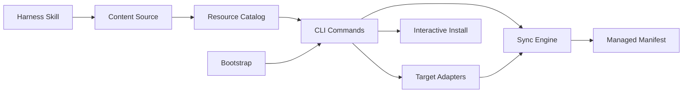

# 业务领域划分

Agent Hub 不是面向终端用户的业务系统，但它仍然有稳定的产品/工程领域。智能体在修改代码或文档时，应先判断变更属于哪个领域，再选择正确的模块和测试。

## 领域清单

| 领域 | 职责说明 | 代码位置 | 关键实体 |
|------|----------|----------|----------|
| Resource Catalog | 维护可安装资源、资源类型、默认安装状态、目标支持关系 | `registry/`, `cli.js` 的 `loadRegistries()` | resource entry, type, target |
| Content Source | 保存 skills、prompts、hooks、agents 的真实内容 | `content/` | skill directory, prompt file, hook file, agent definition |
| Target Adapters | 把通用资源映射到不同 agent 的 config dir 和安装路径 | `cli.js` 的 `adapters`, `configDir()`, `subdir()` | adapter name, env var, destination |
| Sync Engine | 规划和执行复制安装、状态查看、reset、manifest 写入 | `cli.js` 的 `cmdInstall()`, `cmdStatus()`, `cmdReset()` | managed manifest entry, install destination |
| CLI Commands | 解析命令与 flags，调用 registry/adapters/sync，输出用户可读结果 | `cli.js` | install, reset, status, list |
| Interactive Install | 通过终端选择目标、关键词和资源 | `lib/prompt.mjs`, `cli.js` 的 `cmdInteractiveInstall()` | selected target, selected resources |
| Local Verification | 维护零依赖格式检查和轻量命令验证 | `scripts/format.mjs`, `.github/workflows/ci.yml` | format check, list, dry-run install |
| Harness Skill | 提供 Harness Engineering skill、模板、脚本和检查清单 | `content/skills/harness-docs/` | `SKILL.md`, templates, lint scripts |

## 领域间关系

## 领域通信规则

- Resource Catalog 不应知道目标 agent 的具体目录布局；这些规则属于 Target Adapters。
- Target Adapters 不应读取 registry 或执行复制；它们只返回路径决策。
- Sync Engine 不应打印命令输出；输出由 CLI Commands 负责。
- Harness Skill 是普通 content 资源；安装时不能被特殊对待。
- 当前没有 `src/`、`dist/` 或 `install/` 现行模块；不要把归档计划中的 TypeScript 分层当作当前事实。
