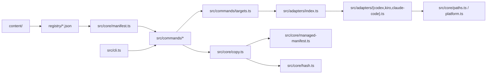

最后生成: 2026-04-26
数据源: `src/**/*.ts`, `registry/*.json`, `content/`
生成范围: bootstrap scan

# 模块依赖图

本文档记录 Agent Hub 当前核心模块之间的依赖方向，供智能体在改动 CLI、registry、adapter 或安装逻辑前快速定位影响范围。

## 高层流向

## 关键依赖规则

| 模块 | 可以依赖 | 不应依赖 |
|------|----------|----------|
| `src/cli.ts` | `src/commands/*`, CLI flag 类型 | `node:fs` copy 细节、target 目录常量 |
| `src/commands/*` | `src/core/*`, `src/adapters/*` | content 文件内容的内部格式 |
| `src/core/manifest.ts` | registry JSON、adapter target 类型 | CLI 输出、目标 config dir |
| `src/core/copy.ts` | adapter destination、hash、managed manifest | command-specific flag parsing |
| `src/adapters/*` | path/platform helpers、resource type directory | registry loading、copy 执行 |
| `content/skills/harness-engineering/*` | skill 自身模板和脚本 | agent-hub CLI internals |

## 当前注意点

- `src/commands/targets.ts` 是 `all` target 分发和 target-specific config-dir 处理的关键路径；改它要跑 target 相关测试。
- `src/core/managed-manifest.ts` 是卸载和状态检查的安全边界；删除行为必须保持 manifest-scoped。
- `content/skills/harness-engineering/scripts/lint-docs.ts` 是 skill 内容的一部分，不应被项目 `AGENTS.md` 当作通用团队必备工具路径硬编码到外部环境。
