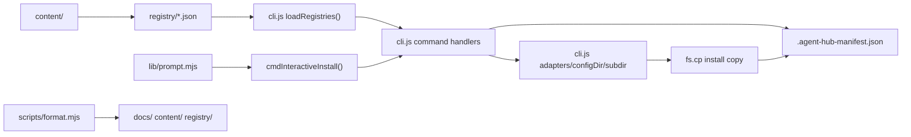

最后生成: 2026-05-10
数据源: `cli.js`, `lib/*.mjs`, `registry/*.json`, `content/`, `scripts/*.mjs`
生成范围: bootstrap scan

# 模块依赖图

本文档记录 Agent Hub 当前核心模块之间的依赖方向，供智能体在改动 CLI、registry、adapter 或安装逻辑前快速定位影响范围。

## 高层流向

## 关键依赖规则

| 模块 | 可以依赖 | 不应依赖 |
|------|----------|----------|
| `cli.js` CLI router | command handlers, `process.argv` | 远程下载、动态执行 content |
| `cli.js` registry loader | `registry/*.json` | 目标 config dir 决策 |
| `cli.js` adapters | env var、默认目录、资源类型子目录 | registry 加载、复制执行 |
| `cmdInstall()` | registry entry、adapter destination、manifest helpers | 交互式键盘输入细节 |
| `cmdStatus()` | manifest entry、destination stat | 写入 manifest 或目标资源 |
| `lib/prompt.mjs` | stdin/stdout raw mode | registry 或安装语义 |
| `scripts/format.mjs` | 文本文件遍历和规范化 | 安装业务逻辑 |
| `content/skills/harness-docs/*` | skill 自身模板和脚本 | agent-hub CLI internals |

## 当前注意点

- `cli.js` 同时承载命令路由、registry 加载、adapter 和 copy 行为；改动时要跑 list、install dry-run、status smoke。
- `.agent-hub-manifest.json` 当前只记录 id/type/source/dest/installedAt，不记录 hash；不要把 drift 检测当作现有能力。
- `content/skills/harness-docs/scripts/lint-docs.ts` 是 skill 内容的一部分，不应被项目 `AGENTS.md` 当作通用团队必备工具路径硬编码到外部环境。
