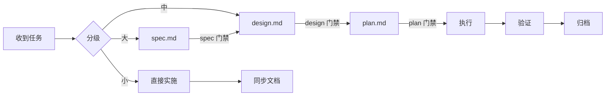

# 需求工作流

## 入口

1. 先读 `AGENTS.md`，确定任务类型
2. 若涉及架构/依赖方向调整，先读 `ARCHITECTURE.md`
3. 查看 `docs/DOMAINS.md` 和 `docs/active/tech-debt-tracker.md`，确认所属领域与已知债务
4. 按下方任务分级表判断走哪条工作流

## 任务分级

| 级别 | 判定条件 | 工作流 | 产出物 |
|------|----------|--------|--------|
| 小任务 | ≤ 3 个 task，单领域，无 CLI 契约或 manifest 语义变更 | 方案确认 → 直接实施 | 无正式文档 |
| 中任务 | 4-8 个 task，或跨 2 个领域，或涉及 CLI flag / manifest / adapter 语义 | design.md → plan.md → 实施 | 需求目录（无 spec） |
| 大任务 | > 8 个 task，跨 3+ 领域，新 target/resource type，或依赖方向变更 | spec.md → design.md → plan.md → 实施 | 完整需求目录 |

**中/大任务判定条件（满足任一即升级）：**
- 跨 2 个以上模块
- 涉及依赖方向变更或新增模块间依赖
- 涉及对外 CLI 契约变更（命令、flag、输出语义、错误信息）
- 涉及 managed manifest 状态机变更（current、drifted、missing、stale）
- 涉及新 target adapter、资源类型或安装目标布局
- 中/大任务中独立 task ≥ 5 个时，使用 subagent 并行实施（详见 `docs/guides/PLANS.md`）

---

## 小任务工作流

```
收到任务 → 评估影响范围 → 直接实施 → 同步文档 → 登记遗留
```

1. **评估影响范围**：确认 ≤ 3 个 task、单模块、无契约变更
2. **直接实施**，保持分层
3. **同步文档**：更新受影响的已有文档（ARCHITECTURE 等）
4. **登记遗留**：有遗留问题记到 `docs/active/tech-debt-tracker.md`

不需要创建需求目录。

---

## 中任务工作流

```
收到任务 → 创建需求目录 → 写 design.md → design 门禁
         → 写 plan.md → plan 门禁 → 执行 → 归档
```

跳过 spec.md（需求已经足够明确，不需要产品规格层面的定义）。

### Step 1: 创建需求目录

创建目录 `docs/active/{需求名}/`，只创建两个文件：

- `design.md`：基于 `docs/active/_template/design.md`
- `plan.md`：基于 `docs/active/_template/plan.md`

不要复制 `spec.md`。中任务默认没有产品规格层。

### Step 2: 写 design.md

输入：任务描述 + 对话中的方案共识
方法论：`docs/guides/DESIGN.md`

**design 门禁：**
- [ ] 数据模型、接口契约、核心流程已填写
- [ ] 影响范围表列出所有需要修改的模块
- [ ] 每条约束可验证
- [ ] 迁移与兼容已填写或标注"不适用"
- [ ] frontmatter status 设为 `draft`

### Step 3: 写 plan.md

输入：通过门禁的 design.md
方法论：`docs/guides/PLANS.md`

**plan 门禁：**
- [ ] 执行模式已确定
- [ ] 每个任务有 id / depends_on / scope / verify / agent / status
- [ ] verify 是可执行的命令
- [ ] frontmatter status 设为 `not-started`

### Step 4: 执行 → 归档

按 `docs/guides/PLANS.md` 执行规则。完成后 plan status → `completed`，design status → `verified`。

---

## 大任务工作流

```
收到任务 → 创建需求目录 → 写 spec.md → spec 门禁
         → 写 design.md → design 门禁
         → 写 plan.md → plan 门禁 → 执行 → 归档
```

### Step 1: 创建需求目录

将 `docs/active/_template/` 整个目录复制为 `docs/active/{需求名}/`。

### Step 2: 写 spec.md

输入：用户/人类提出的需求描述
方法论：`docs/guides/SPEC.md`

**spec 门禁：**
- [ ] 问题与动机已写清
- [ ] In Scope 和 Out of Scope 都已列出
- [ ] 每个用户场景有编号步骤
- [ ] 每个场景至少一条 Given/When/Then 验收标准
- [ ] 异常与边界情况已覆盖
- [ ] 没有技术实现细节
- [ ] frontmatter status 设为 `draft`

### Step 3: 写 design.md

输入：通过门禁的 spec.md
方法论：`docs/guides/DESIGN.md`

**从 spec 到 design 的映射：**

| spec 中的 | → design 中的 |
|-----------|--------------|
| 用户场景 | 核心流程（Mermaid） |
| 输入与输出 | 接口契约 |
| 异常与边界 | 异常处理策略 |
| 产品约束 | 约束（继承 + 叠加技术约束） |
| 验收标准 | 验证方式 |

**design 门禁：**（同中任务）
- [ ] 数据模型、接口契约、核心流程已填写
- [ ] 影响范围表列出所有需要修改的模块
- [ ] 每条约束可验证
- [ ] 迁移与兼容已填写或标注"不适用"
- [ ] 发布与回滚策略已定义
- [ ] 至少一个备选方案
- [ ] frontmatter status 设为 `draft`

### Step 4: 写 plan.md

输入：通过门禁的 design.md
方法论：`docs/guides/PLANS.md`

**从 design 到 plan 的映射：**

| design 中的 | → plan 中的 |
|-------------|------------|
| 影响范围表每一行 | 一个任务 |
| 模块间依赖关系 | depends_on |
| 验证方式 | verify 命令 |
| 迁移与兼容 | 前置任务 |

**plan 门禁：**（同中任务）

### Step 5: 执行 → 归档

完成后：plan → `completed`，design → `verified`，spec → `shipped`。

---

## 回退规则

任何阶段发现上游问题，必须回退修复，不允许在当前阶段打补丁：

```
plan 发现 design 有问题 → 回到 design，修复后重过门禁
design 发现 spec 有问题 → 回到 spec，修复后重过门禁
spec 需要澄清 → 暂停，请求人类输入
```

回退时：更新上游文档 → 更新 frontmatter 日期 → 检查下游是否需要同步 → 重过门禁。

## 文档与代码冲突

- 以代码现状为主（能运行的、当前逻辑的真实行为）
- 必须显式指出冲突，在 docs/ 补齐新事实或修正文档
- 冲突记录到 `docs/active/tech-debt-tracker.md`

## 全景


